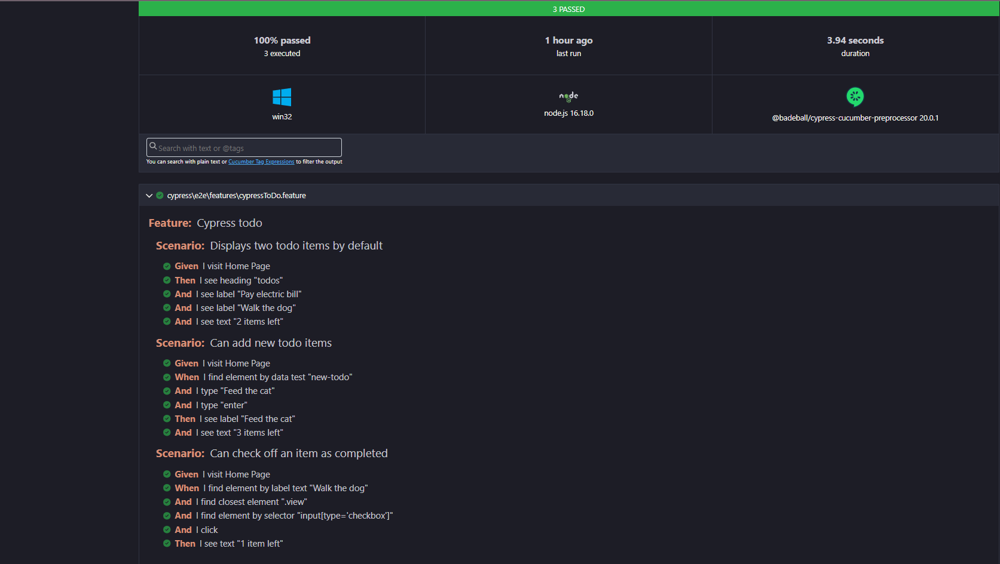

# Cypress with Cucumber
Basic example of using Cypress with Cucumber (BDD) and Page Object Model (POM) which is an architectural design pattern commonly used in test automation, especially for web applications. The primary goal of the Page Object Model is to enhance test code maintainability, readability, and reusability. 

# Table of contents

* [Getting Started](#get-started)
* [Setup Locally](#setup-locally)
* [How to run the tests](#how-to-run-the-tests)
* [Test Strategy](#test-strategy)
* [Test Cases](#test-cases)
* [Assumptions and Decisions](assumptions-and-decisions)

## Getting Started
Make sure you have configured right your git account and you have the following installed:

- [Node.js](https://nodejs.org/)
- [Docker](https://www.docker.com/) (if running tests in Docker)


## Setup Locally:
 ```bash
 git clone https://github.com/valdrinnz/cy-cucumber
 cd your-project
 ```
#### Install project dependencies:
 ```bash
 npm install
 ```
## How to run the tests
 ```bash
 npx cypress open
 ```
#### Running Cypress Test Locally - Headless Mode:
 ```bash
 npx cypress run
 ```

### Running Cypress in Docker:

#### Docker Build Image:
 ```bash
 docker build -t my-cypress-tests .
 ```
 #### Run Docker Container:
 ```bash
 docker run my-cypress-tests
 ```

**HTML report**:


### Find Problems

ESLint statically analyzes the code to find problems.

```bash
npm run lint:eslint
```

## Test Strategy

Our test strategy focuses on verifying the functionality of a todo list web application using Cypress and Cucumber. The chosen application, represented by the Cypress todo feature, demonstrates key interactions such as displaying default todo items, adding new todo items, and checking off completed items. 

## Test Cases
Choice of Test Cases:

### Scenario: Displays two todo items by default
#### Description: Verifies that upon visiting the home page of the todo application, two default todo items ("Pay electric bill" and "Walk the dog") are displayed along with the correct count of items.


### Scenario: Can add new todo items
#### Description: Validates the functionality to add a new todo item to the list. Feed the cat is added and it is verified there are 3 items in the list


### Scenario: Can check off an item as completed
#### Description: Tests the ability to mark a todo item as completed by checking off the corresponding checkbox. After marking done a todo, we can see that we have left one more to do remaining.

#### Test Case Files:
#### Feature File: 
 ```bash
cypressToDo.feature located in the e2e/features directory.
 ```
 #### Step Definitions:
 ```bash
cypressToDoStep.ts located in the e2e/steps/stepDefinition/todo directory.
 ```

 #### ToDoPage.ts
 ```bash
ToDoPage.ts located in the e2e/steps/pages/ToDo directory.
 ```
## Assumptions and Decisions:
